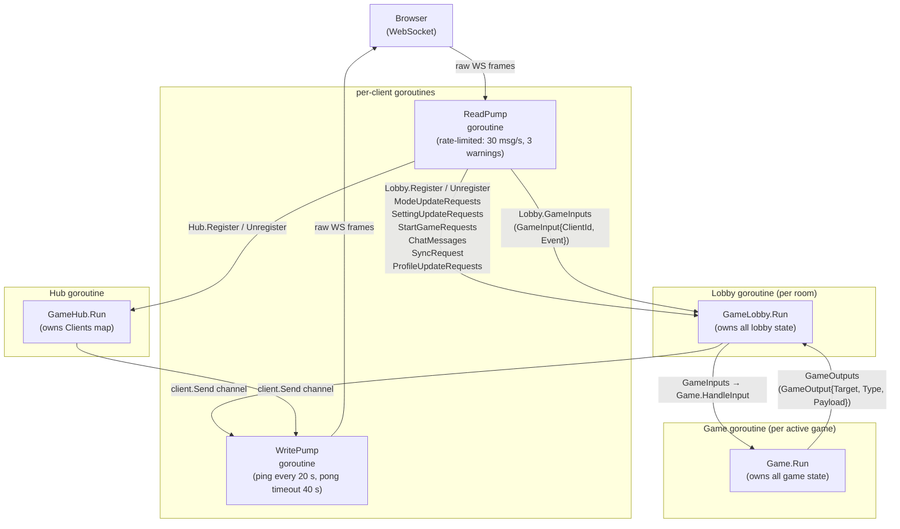
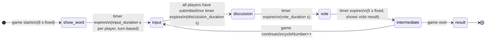
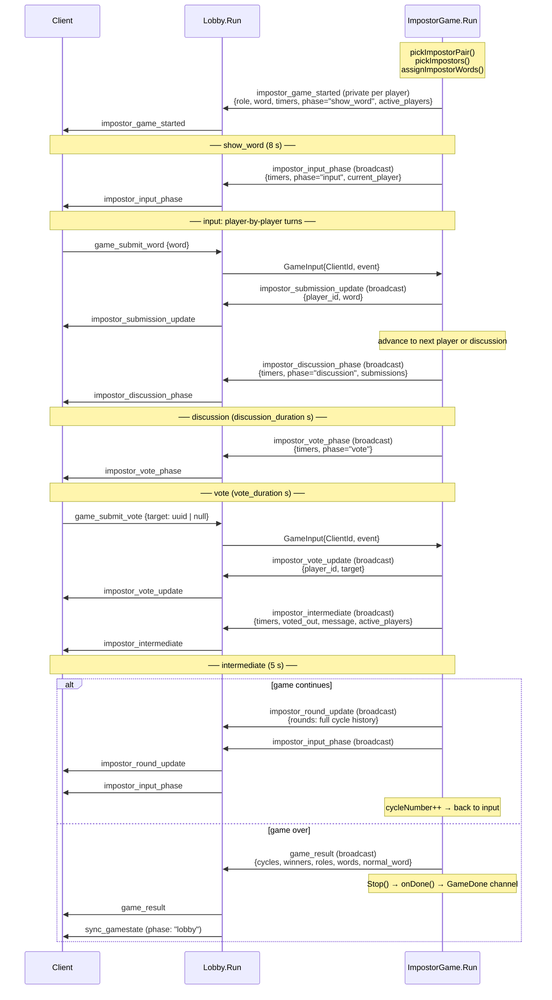
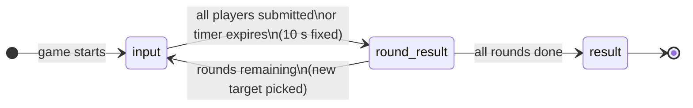

# Server, Architecture & Protocol

This document covers the complete message flow from the frontend WebSocket connection through
the server's goroutine topology, down to the active game and back.

---

## HTTP Endpoints

| Method | Path                 | Handler           | Description                                                             |
| ------ | -------------------- | ----------------- | ----------------------------------------------------------------------- |
| `GET`  | `/api/status`        | `HandleStatus`    | Health check, returns `{status: "online"}`                              |
| `POST` | `/api/game/username` | `NewUsername`     | Generates a random Swedish display name for an already-connected client |
| `GET`  | `/ws/game`           | `HandleWebSocket` | Upgrades to WebSocket; creates a `Client` and registers it with the hub |

---

## Goroutine & Channel Topology

Every layer owns its state exclusively through a single goroutine. Goroutines communicate
only via typed channels, no shared-memory locks except the hub's `LobbiesMutex` (used
only by HTTP upgrade handlers that run outside the hub goroutine).

A `nil` `GameOutput.Target` means broadcast to all clients in the lobby.
A non-nil `Target` means send privately to that one player.

---

## Pre-game: Connection & Lobby Events

### Client → Server

| Event              | Payload                              | Auth                                  | Description                                                                      |
| ------------------ | ------------------------------------ | ------------------------------------- | -------------------------------------------------------------------------------- |
| `create_lobby`     | ,                                    | any                                   | Creates a new room; sender becomes host                                          |
| `join_lobby`       | `{lobby_code: string}`               | any                                   | Joins existing room by code                                                      |
| `leave_lobby`      | ,                                    | any                                   | Leaves current room                                                              |
| `update_user`      | `{username?, background?}`           | any                                   | Updates display name / color                                                     |
| `change_mode`      | `{mode: GameMode}`                   | host only                             | Switches game mode                                                               |
| `update_setting`   | `{key: GameSetting, value: float64}` | host only                             | Updates one setting                                                              |
| `send_chatmessage` | `{message: string}`                  | any (active players only during game) | Broadcasts a chat message                                                        |
| `start_game`       | ,                                    | host only                             | Starts the game                                                                  |
| `sync_request`     | ,                                    | any                                   | Requests the server to re-broadcast current lobby state to the requesting client |

### Server → Client

| Event              | Target    | Payload                              | Trigger                                                            |
| ------------------ | --------- | ------------------------------------ | ------------------------------------------------------------------ |
| `connected_to_hub` | private   | `{user: UserProfile}`                | On WS connection                                                   |
| `joined_lobby`     | private   | ,                                    | After successful join/create                                       |
| `left_lobby`       | private   | ,                                    | After leaving                                                      |
| `join_error`       | private   | ,                                    | When a join attempt fails (game in progress, lobby full, bad code) |
| `sync_gamestate`   | broadcast | `{lobbystate: LobbyState, message?}` | Any shared state change                                            |
| `error`            | private   | `{message: string}`                  | Validation failure                                                 |
| `success`          | private   | `{message: string}`                  | Positive acknowledgment                                            |
| `chat_message`     | broadcast | `{sender, message, date}`            | Chat message received                                              |
| `game_started`     | broadcast | ,                                    | Host triggers start                                                |

`LobbyState` contains `{code, mode, phase, host, users, settings}`.
`phase` is either `"lobby"` or `"game_started"`.
`settings` is the settings struct for the currently active mode (see Settings Reference).

---

## Implemented Game Modes

| Mode string       | Struct          | Status                           |
| ----------------- | --------------- | -------------------------------- |
| `impostor`        | `ImpostorGame`  | Implemented                      |
| `anti_match`      | `AntiMatchGame` | Implemented                      |
| `contexto_battle` | `ContextoGame`  | Settings only, game not wired up |
| `synonym_duel`    | ,               | Settings only, game not wired up |

---

## Impostor Game Flow

### Phase State Machine

Input is **turn-based**: each player submits one at a time, ordered by a circular doubly-linked
list of active players. The server tracks `currentPlayer` and broadcasts it with each
`impostor_input_phase` event. Early submission advances the turn immediately.

Game over conditions (checked after each `intermediate` phase):

- Impostors win: `impostors >= normal_players`
- Normal players win: all impostors eliminated
- Impostors win by timeout: `cycleNumber` reaches 127

### Events, Server → Client

| Event                        | Target               | Payload fields                                                                       | When                                              |
| ---------------------------- | -------------------- | ------------------------------------------------------------------------------------ | ------------------------------------------------- |
| `impostor_game_started`      | private (per player) | `start_time, ready_time, end_time, phase, active_players, current_round, role, word` | Game start (show_word phase)                      |
| `impostor_input_phase`       | broadcast            | `start_time, ready_time, end_time, phase, current_player`                            | Start of each player's turn in input phase        |
| `impostor_submission_update` | broadcast            | `player_id, word`                                                                    | Player submits a word                             |
| `impostor_discussion_phase`  | broadcast            | `start_time, ready_time, end_time, phase, submissions`                               | Input cycle complete, discussion begins           |
| `impostor_vote_phase`        | broadcast            | `start_time, ready_time, end_time, phase`                                            | Discussion ends, vote begins                      |
| `impostor_vote_update`       | broadcast            | `player_id, target`                                                                  | Player casts a vote (`target` is `null` for skip) |
| `impostor_intermediate`      | broadcast            | `start_time, ready_time, end_time, phase, voted_out, message, active_players`        | Vote phase ends; shows elimination result         |
| `impostor_round_update`      | broadcast            | `rounds` (full cycle history)                                                        | Start of a new cycle                              |
| `game_result`                | broadcast            | `cycles, winners, roles, words, normal_word`                                         | Game over                                         |

All phase events include `start_time`, `ready_time` (= start + 2 s sync delay), and `end_time`
as Unix millisecond timestamps so clients can render countdown timers.
`ready_time` is omitted (set equal to `start_time`) for `impostor_intermediate` since result
display begins immediately with no sync delay.

### Events, Client → Server

| Event              | Payload                  | Valid phase                                                      |
| ------------------ | ------------------------ | ---------------------------------------------------------------- |
| `game_submit_word` | `{word: string}`         | `input`, only accepted from `current_player`                     |
| `game_submit_vote` | `{target: uuid \| null}` | `vote`, `null` = skip; only from active (non-eliminated) players |

### Sequence Diagram (single cycle)

---

## Anti-Match Game Flow

Players are shown a target word each round and must submit a word that is semantically
close to the target but **not** the same word as any other player. Duplicate submissions
score 0. Non-duplicate submissions are scored by cosine distance to the target
(`score = max(0, 100 − distance × 100)`). A new target is picked each round.

### Phase State Machine

### Events, Server → Client

| Event                         | Target    | Payload fields                                                                                       | When                                                          |
| ----------------------------- | --------- | ---------------------------------------------------------------------------------------------------- | ------------------------------------------------------------- |
| `antimatch_input_phase`       | broadcast | `start_time, ready_time, end_time, phase, target_word, current_round, total_rounds`                  | Start of each input round                                     |
| `antimatch_submission_update` | broadcast | `player_id, has_submitted`                                                                           | Player submits a word (word itself is hidden until round end) |
| `antimatch_round_result`      | broadcast | `start_time, ready_time, end_time, phase, target_word, results, winner, current_round, total_rounds` | All players submitted or timer expired                        |
| `game_result`                 | broadcast | `total_scores`                                                                                       | Game over                                                     |

`results` is a map of `player_id → {word, score, is_duplicate, total_score}`.
`winner` is the `player_id` with the highest non-duplicate score for that round, or `null`.

### Events, Client → Server

| Event              | Payload          | Valid phase                                                                         |
| ------------------ | ---------------- | ----------------------------------------------------------------------------------- |
| `game_submit_word` | `{word: string}` | `input`, word must exist in dictionary; last write wins if submitted multiple times |

### Anti-Match Scoring

Words are resolved via `LemmaMap` before lookup (surface form → canonical lemma).
If the submitted word is not in the dictionary, the server returns an error event to that
player and does not register the submission.
When all players have submitted, the round advances immediately without waiting for the timer.

---

## Settings Reference

### Impostor

| Key                   | Default | Min  | Max   |
| --------------------- | ------- | ---- | ----- |
| `input_duration`      | 30 s    | 10 s | 60 s  |
| `discussion_duration` | 45 s    | 30 s | 150 s |
| `impostor_count`      | 1       | 1    | 4     |
| `vote_duration`       | 30 s    | 10 s | 60 s  |

A `SYNC_DELAY` of 2 s is added server-side to every phase `end_time` to compensate for
network latency before the next phase event arrives.

### Anti-Match

| Key              | Default | Min  | Max  |
| ---------------- | ------- | ---- | ---- |
| `input_duration` | 20 s    | 10 s | 60 s |
| `rounds`         | 3       | 1    | 5    |

### Contexto Battle (settings only, game not implemented)

| Key              | Default | Min  | Max   |
| ---------------- | ------- | ---- | ----- |
| `round_duration` | 120 s   | 60 s | 600 s |
| `word_type`      | 1       | 1    | 2     |
| `rounds`         | 3       | 1    | 5     |

### Synonym Duel (settings only, game not implemented)

| Key              | Default | Min  | Max  |
| ---------------- | ------- | ---- | ---- |
| `round_duration` | 20 s    | 10 s | 60 s |
| `rounds`         | 3       | 1    | 5    |
| `word_type`      | 1       | 1    | 2    |

---

## Known Gaps / TODOs

| #   | Location                              | Description                                                                                                                                      |
| --- | ------------------------------------- | ------------------------------------------------------------------------------------------------------------------------------------------------ |
| 1   | `lobby.go` (`StartGameRequests` case) | `ModeContextoBattle` and `ModeSynonymDuel` are not in the switch, `lobby.CurrentGame` stays `nil` and the client gets "Spelläget stöds inte än". |
| 2   | `antimatch.go` (`Run`)                | `playerLeft` channel is not consumed, a player disconnecting mid-game is silently ignored and they keep a slot in the round entries map.         |
| 3   | `impostor.go` (`processInput`)        | No per-player vote acknowledgment, after casting a vote the voter receives no confirmation event, only the broadcast `impostor_vote_update`.     |
| 4   | `websocket.go` (`upgrader`)           | `CheckOrigin` always returns `true`, all origins are accepted. Must be restricted before production.                                             |
